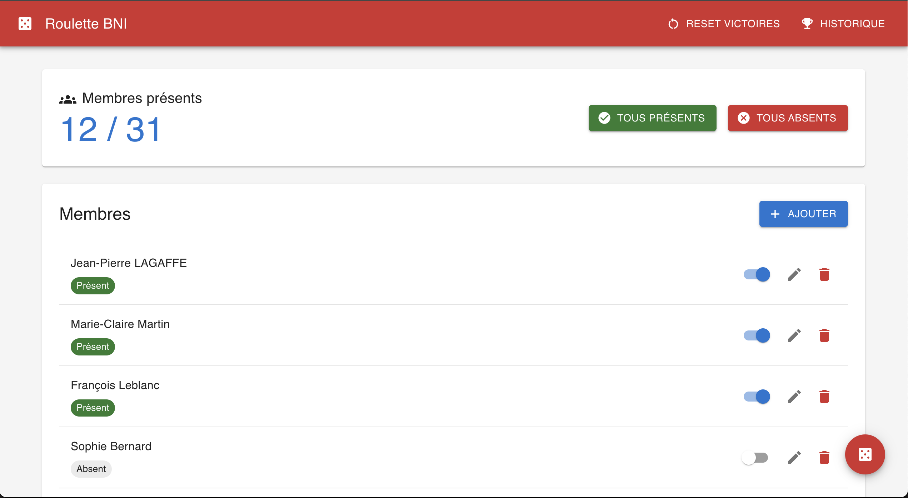
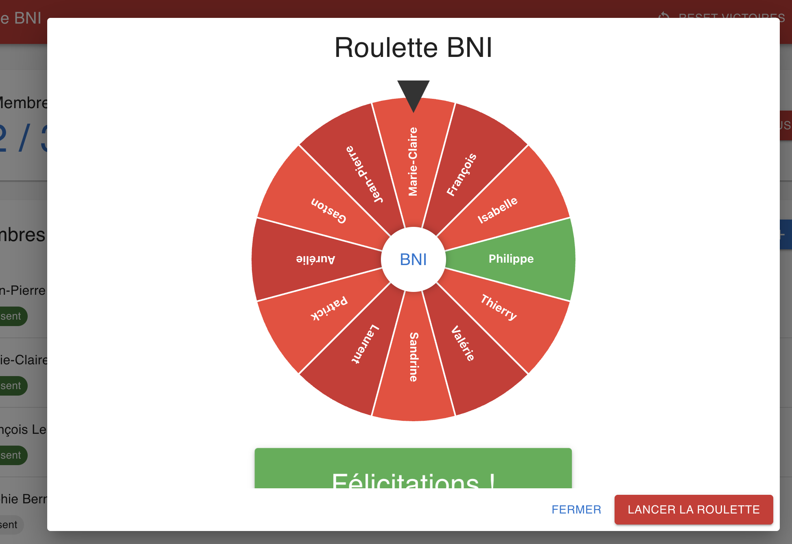

# Roulette BNI

Application de tirage au sort pondéré pour les réunions BNI (Business Network International).

**Créé par Thomas GALIBERT - DEMERYS INVESTMENT** ([www.demerys.com](https://www.demerys.com))

## Description

Cette application permet de gérer une liste de membres et d'effectuer des tirages au sort avec une roulette interactive de style casino. La particularité de cette application est son système de pondération qui réduit les chances de gagner après chaque victoire, garantissant ainsi une distribution plus équitable des gains sur le long terme.

## Captures d'écran

### Interface de gestion des membres


### Roulette interactive


## Fonctionnalités

- 📝 **Gestion des membres** : Ajouter, modifier, supprimer des membres
- ✅ **Gestion de la présence** : Marquer les membres présents/absents individuellement ou en masse
- 🎰 **Roulette interactive** : Animation visuelle style casino avec segments colorés
- 🏆 **Historique des gains** : Suivi des victoires de chaque membre
- ⚖️ **Tirage pondéré** : Algorithme intelligent qui équilibre les chances
- 🔄 **Réinitialisation** : Reset automatique ou manuel des compteurs

## Algorithme de sélection pondérée

### Principe de base

L'algorithme utilise un système de poids pour chaque participant présent. Plus un membre a gagné récemment, plus son poids (et donc ses chances) diminue.

### Calcul des poids

1. **Poids de base** : Chaque membre commence avec un poids de 1.0

2. **Réduction selon les victoires** :
   - À chaque victoire, le poids est multiplié par 0.7
   - Formule : `poids = 0.7^nombre_de_victoires`
   - Exemples :
     - 0 victoire : poids = 1.0 (100% des chances normales)
     - 1 victoire : poids = 0.7 (70% des chances)
     - 2 victoires : poids = 0.49 (49% des chances)
     - 3 victoires : poids = 0.343 (34.3% des chances)

3. **Pénalité supplémentaire pour victoire récente** :
   - Si la dernière victoire date de moins de 7 jours
   - Le poids est divisé par 2 supplémentaire
   - Exemple : 1 victoire il y a 3 jours = 0.7 × 0.5 = 0.35

4. **Réinitialisation après 3 mois** :
   - Les compteurs sont automatiquement remis à zéro après 90 jours
   - Permet un nouveau cycle équitable

### Processus de sélection

1. Calcul du poids total de tous les participants
2. Génération d'un nombre aléatoire entre 0 et le poids total
3. Parcours cumulatif des poids jusqu'à dépasser le nombre aléatoire
4. Le membre correspondant est sélectionné

### Exemple pratique

Supposons 4 membres présents :
- Alice : 0 victoire → poids = 1.0
- Bob : 1 victoire → poids = 0.7
- Claire : 2 victoires → poids = 0.49
- David : 1 victoire récente → poids = 0.35

Poids total = 1.0 + 0.7 + 0.49 + 0.35 = 2.54

Probabilités :
- Alice : 1.0/2.54 = 39.4%
- Bob : 0.7/2.54 = 27.6%
- Claire : 0.49/2.54 = 19.3%
- David : 0.35/2.54 = 13.8%

## Architecture technique

### Backend (Go/Gin)
- API REST avec endpoints CRUD
- Base de données SQLite avec GORM
- Middleware CORS configuré
- Port : 8080

### Frontend (SolidJS)
- Framework réactif avec TypeScript
- Material Design 3 (SUID)
- Animations SVG pour la roulette
- Port : 3000

### Base de données
- **Table `persons`** : Membres avec compteur de victoires
- **Table `winners`** : Historique complet des tirages

## Installation et démarrage

```bash
# Cloner le repository
git clone [URL_DU_REPO]
cd roulette

# Démarrer les deux serveurs
./run.sh
```

L'application sera accessible sur http://localhost:3000

## Utilisation

1. **Ajouter des membres** : Cliquer sur "Ajouter" et saisir le nom
2. **Marquer la présence** : Utiliser les switchs individuels ou les boutons "Tous présents/absents"
3. **Lancer la roulette** : Cliquer sur le bouton flottant rouge (au moins 1 présent requis)
4. **Consulter l'historique** : Bouton "Historique" dans la barre d'outils
5. **Réinitialiser** : 
   - Global : Bouton "Reset victoires" dans la barre
   - Individuel : Icône refresh à côté du membre (si victoires > 0)

## Développement

### Commandes utiles

```bash
# Backend
cd backend
go run main.go          # Démarrer le serveur
go build -o server      # Compiler

# Frontend
cd frontend
npm run dev             # Mode développement
npm run build           # Build production
```

### Structure des fichiers

```
roulette/
├── backend/
│   ├── main.go         # Point d'entrée
│   ├── models/         # Modèles de données
│   ├── handlers/       # Contrôleurs API
│   └── database/       # Configuration DB
├── frontend/
│   ├── src/
│   │   ├── App.tsx     # Composant principal
│   │   ├── components/ # Composants réutilisables
│   │   ├── services/   # Services API
│   │   └── types/      # Types TypeScript
│   └── package.json
└── run.sh              # Script de démarrage
```

## Auteur

**Thomas GALIBERT**  
DEMERYS INVESTMENT  
[www.demerys.com](https://www.demerys.com)

## Licence

Ce projet est distribué sous licence MIT. Voir le fichier [LICENSE](LICENSE) pour plus de détails.

Copyright (c) 2025 Thomas GALIBERT - DEMERYS INVESTMENT